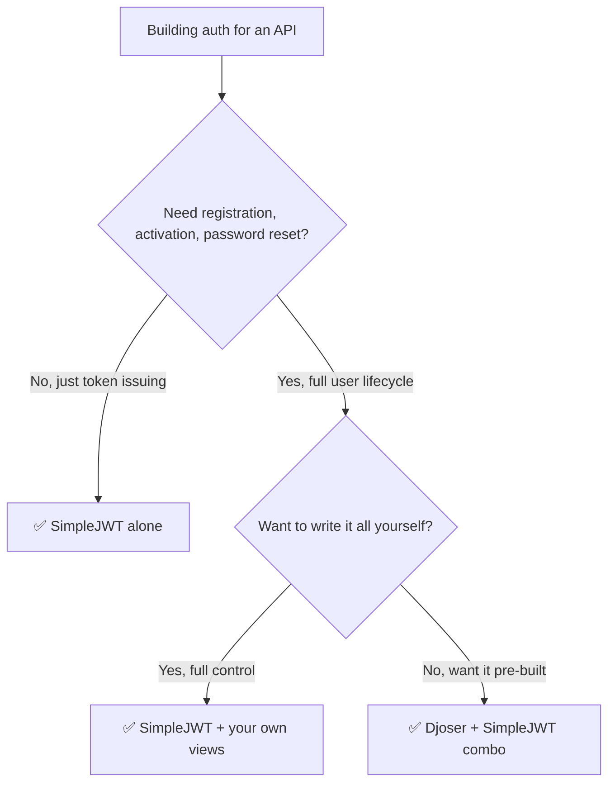

## 🧠 The Core Confusion

- **SimpleJWT** = a **token engine** 🔧 — it only knows how to _issue, verify, and refresh_ JWTs. It has zero opinion about registration, password reset, email verification, etc.
- **Djoser** = a **set of pre-built auth endpoints** 📦 (register, activate, reset password, change password, me, etc.) — it does NOT generate tokens itself. It delegates token creation to whichever backend you plug in (Token auth, or SimpleJWT).

> [!tip] One-line mental model SimpleJWT answers _"how do I prove who I am on each request?"_ Djoser answers _"how does a user sign up, verify email, and manage their account?"_

They're not alternatives — Djoser commonly sits **on top of** SimpleJWT.

---
## 🎫 djangorestframework-simplejwt

Handles only the JWT token lifecycle.
### What it provides out of the box

- `POST /api/token/` → obtain access + refresh token pair
- `POST /api/token/refresh/` → exchange refresh token for new access token
- `POST /api/token/verify/` → verify a token's validity
- `POST /api/token/blacklist/` → blacklist a refresh token (logout)
- Custom claims support (attach `role`, `is_staff`, etc. to the token)
### Setup

```python
INSTALLED_APPS += ['rest_framework_simplejwt']

REST_FRAMEWORK = {
    'DEFAULT_AUTHENTICATION_CLASSES': [
        'rest_framework_simplejwt.authentication.JWTAuthentication',
    ],
}
```

```python
from rest_framework_simplejwt.views import TokenObtainPairView, TokenRefreshView

urlpatterns = [
    path('api/token/', TokenObtainPairView.as_view()),
    path('api/token/refresh/', TokenRefreshView.as_view()),
]
```

**✅ Pros**

- Lightweight, does one thing well
- Full control over token claims, lifetimes, blacklisting
- No opinion on your user model, registration flow, or serializers

**❌ Cons**

- ❗ No registration, password reset, email verification, or account activation — you build all of that yourself
- No "me" / profile endpoint out of the box
- You write your own registration serializer + view from scratch

---
## 📦 Djoser

A collection of ready-made REST endpoints for the _entire user lifecycle_, built to sit on top of Django's auth system.

### What it provides out of the box

- `POST /auth/users/` → register
- `POST /auth/users/activation/` → activate account via emailed token
- `POST /auth/users/resend_activation/`
- `POST /auth/users/reset_password/` → send reset email
- `POST /auth/users/reset_password_confirm/`
- `POST /auth/users/set_password/` → change password while logged in
- `GET/PUT/PATCH/DELETE /auth/users/me/` → current user profile
- `POST /auth/token/login/` + `POST /auth/token/logout/` → **only** if using DRF's basic TokenAuthentication backend

> [!warning] Djoser's own token endpoints are for TokenAuthentication, not JWT Djoser ships `token/login/` and `token/logout/` for DRF's built-in static token auth. For JWT, you swap those out for **SimpleJWT's own JWT endpoints** instead (see below) — Djoser explicitly supports this combo.

### Setup (with SimpleJWT as the token backend)

```python
INSTALLED_APPS += ['djoser', 'rest_framework_simplejwt']

REST_FRAMEWORK = {
    'DEFAULT_AUTHENTICATION_CLASSES': [
        'rest_framework_simplejwt.authentication.JWTAuthentication',
    ],
}

DJOSER = {
    'LOGIN_FIELD': 'email',
    'USER_CREATE_PASSWORD_RETYPE': True,
    'SEND_ACTIVATION_EMAIL': True,
    'SERIALIZERS': {
        'user_create': 'djoser.serializers.UserCreateSerializer',
    },
}
```

```python
# urls.py
urlpatterns = [
    path('auth/', include('djoser.urls')),          # registration, activation, password reset, /me
    path('auth/', include('djoser.urls.jwt')),       # JWT login/refresh, powered by SimpleJWT
]
```

`djoser.urls.jwt` gives you:

- `POST /auth/jwt/create/` → login (returns access + refresh)
- `POST /auth/jwt/refresh/`
- `POST /auth/jwt/verify/`

**✅ Pros**

- Registration, activation, password reset, "me" endpoint — all done, tested, maintained
- Highly configurable via the `DJOSER` settings dict (custom serializers, permissions per endpoint, email templates)
- Saves days of boilerplate for a typical "user signs up with email" flow

**❌ Cons**

- Extra abstraction layer — customizing beyond what settings expose means overriding Djoser's views/serializers
- Less obvious "what's actually happening" for beginners vs writing it yourself
- Some default behaviors (e.g., activation email flow) need real SMTP/email backend configured to test properly
- Slight version-compatibility coupling — Djoser + SimpleJWT + DRF versions need to line up

---
## ⚖️ Comparison Table

|🎫 SimpleJWT|📦 Djoser|
|---|---|---|
|**What it is**|JWT token engine|Pre-built auth endpoint set|
|**Registration**|❌ Not included|✅ Included|
|**Email activation**|❌ Not included|✅ Included|
|**Password reset**|❌ Not included|✅ Included|
|**Token issuing/refresh**|✅ Core feature|➖ Delegates to SimpleJWT (or TokenAuth)|
|**Custom JWT claims**|✅ Yes|➖ Inherited from SimpleJWT underneath|
|**"Me" / profile endpoint**|❌ Not included|✅ Included|
|**Setup effort**|Low, but you build the rest|Low, batteries included|
|**Flexibility**|High (you write everything around it)|Medium (config-driven, override for edge cases)|

---
## 🤝 Using Them Together

This is the **standard real-world combo**: Djoser for the user-management endpoints, SimpleJWT underneath for the actual tokens.

```python
INSTALLED_APPS = [
    ...
    'rest_framework',
    'rest_framework_simplejwt',
    'rest_framework_simplejwt.token_blacklist',  # for logout/blacklist
    'djoser',
]

REST_FRAMEWORK = {
    'DEFAULT_AUTHENTICATION_CLASSES': [
        'rest_framework_simplejwt.authentication.JWTAuthentication',
    ],
}
```

```python
# urls.py
urlpatterns = [
    path('auth/', include('djoser.urls')),
    path('auth/', include('djoser.urls.jwt')),
]
```

Resulting endpoint set:

```
POST /auth/users/               → register
POST /auth/users/activation/    → activate
POST /auth/jwt/create/          → login (JWT pair)
POST /auth/jwt/refresh/         → refresh access token
GET  /auth/users/me/            → current user profile
POST /auth/users/reset_password/ → forgot password flow
```

---

## 🧩 Which One Do You Actually Need?



---

## ⚠️ Common Pitfalls

- 🚨 Trying to use Djoser's `token/login/` endpoint expecting JWTs — that endpoint is for DRF's basic TokenAuthentication, not JWT. Use `djoser.urls.jwt` instead.
- 🚨 Forgetting `rest_framework_simplejwt.token_blacklist` in `INSTALLED_APPS` → Djoser/SimpleJWT logout via blacklist silently fails.
- 🚨 Assuming Djoser handles token refresh — it just re-exposes SimpleJWT's refresh view; settings like `ACCESS_TOKEN_LIFETIME` still live in `SIMPLE_JWT`, not `DJOSER`.
- 🚨 Not configuring a real email backend → activation/reset emails silently go nowhere (or to console in dev).
- 🚨 Overriding Djoser serializers incorrectly — always subclass, don't monkey-patch, or upgrades will break silently.

---
## ✅ Best Practices Checklist

- [ ] Use SimpleJWT alone if you already have your own registration/user-management flow
- [ ] Use Djoser + SimpleJWT combo for a fast, standard "email sign up + JWT login" API
- [ ] Add `token_blacklist` app for proper logout support
- [ ] Configure `DJOSER['SERIALIZERS']` to customize fields returned on register/me instead of overriding views
- [ ] Set `SIMPLE_JWT['ACCESS_TOKEN_LIFETIME']` / `REFRESH_TOKEN_LIFETIME` explicitly — don't rely on defaults
- [ ] Test activation/reset email flows with a real email backend before shipping
- [ ] Keep `DJOSER` and `SIMPLE_JWT` settings dicts separate — they configure different layers