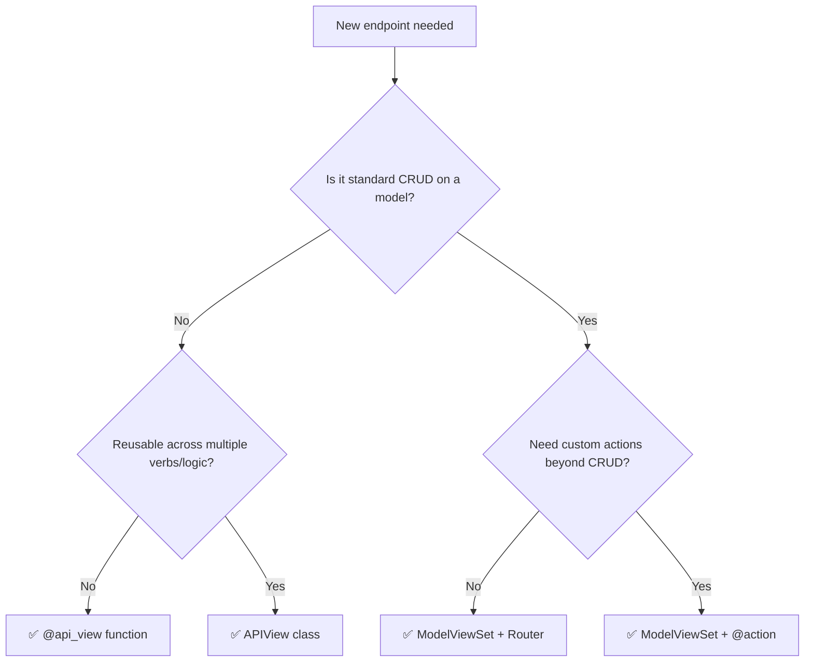

## 🪜 The Abstraction Ladder

DRF views form a ladder from **most control / most code** → **least control / least code**:

```
@api_view (function)  →  APIView  →  Generic + Mixins  →  ModelViewSet
🔧 full control    🔩 more control 🧱 building blocks  🏗️ almost free CRUD
```

Every level is built on the one below it — `ModelViewSet` is just generics + mixins wired together, and generics are just `APIView` with helper methods.

---
## 1️⃣ Function-Based Views (`@api_view`)

The most explicit style — a plain function decorated to behave like a DRF view.

```python
from rest_framework.decorators import api_view, permission_classes
from rest_framework.response import Response
from rest_framework import status
from .models import Book
from .serializers import BookSerializer

@api_view(['GET', 'POST'])
@permission_classes([])  # add IsAuthenticated etc. as needed
def book_list(request):
    if request.method == 'GET':
        books = Book.objects.all()
        serializer = BookSerializer(books, many=True)
        return Response(serializer.data)

    if request.method == 'POST':
        serializer = BookSerializer(data=request.data)
        if serializer.is_valid():
            serializer.save()
            return Response(serializer.data, status=status.HTTP_201_CREATED)
        return Response(serializer.errors, status=status.HTTP_400_BAD_REQUEST)


@api_view(['GET', 'PUT', 'DELETE'])
def book_detail(request, pk):
    book = Book.objects.get(pk=pk)
    if request.method == 'GET':
        return Response(BookSerializer(book).data)
    if request.method == 'PUT':
        serializer = BookSerializer(book, data=request.data)
        if serializer.is_valid():
            serializer.save()
            return Response(serializer.data)
        return Response(serializer.errors, status=400)
    if request.method == 'DELETE':
        book.delete()
        return Response(status=204)
```

```python
# urls.py
urlpatterns = [
    path('books/', book_list),
    path('books/<int:pk>/', book_detail),
]
```

**✅ Pros**

- Total transparency — every line is visible, nothing "magic"
- Easiest for beginners to understand HTTP verb handling
- Great for one-off, non-CRUD endpoints (e.g., a custom report or webhook)

**❌ Cons**

- Lots of repeated boilerplate across endpoints
- No built-in pagination/filtering hooks — you wire it all yourself
- Doesn't scale well once you have many resources

---
## 2️⃣ APIView (class-based)

Same control as function views, but organized as a class with one method per HTTP verb.

```python
from rest_framework.views import APIView
from rest_framework.response import Response
from rest_framework import status

class BookList(APIView):
    def get(self, request):
        books = Book.objects.all()
        return Response(BookSerializer(books, many=True).data)

    def post(self, request):
        serializer = BookSerializer(data=request.data)
        serializer.is_valid(raise_exception=True)
        serializer.save()
        return Response(serializer.data, status=status.HTTP_201_CREATED)


class BookDetail(APIView):
    def get_object(self, pk):
        return Book.objects.get(pk=pk)

    def get(self, request, pk):
        return Response(BookSerializer(self.get_object(pk)).data)

    def put(self, request, pk):
        book = self.get_object(pk)
        serializer = BookSerializer(book, data=request.data)
        serializer.is_valid(raise_exception=True)
        serializer.save()
        return Response(serializer.data)

    def delete(self, request, pk):
        self.get_object(pk).delete()
        return Response(status=status.HTTP_204_NO_CONTENT)
```

```python
urlpatterns = [
    path('books/', BookList.as_view()),
    path('books/<int:pk>/', BookDetail.as_view()),
]
```

**✅ Pros**

- Cleaner organization than function views (one class per resource)
- Easy to add `permission_classes`, `authentication_classes`, `throttle_classes` as class attributes
- Still full control over logic per verb

**❌ Cons**

- Still manually writes serializer boilerplate for every method
- No shared CRUD logic — every resource repeats the same pattern

---
## 3️⃣ Generic Views (mixins + generics)

DRF factors common CRUD patterns into **mixins**, then combines them into ready-made **generic views**.

### 🧱 Mixins (the raw building blocks)

- `ListModelMixin` → `.list()`
- `CreateModelMixin` → `.create()`
- `RetrieveModelMixin` → `.retrieve()`
- `UpdateModelMixin` → `.update()`
- `DestroyModelMixin` → `.destroy()`

```python
from rest_framework import mixins, generics

class BookList(mixins.ListModelMixin, mixins.CreateModelMixin, generics.GenericAPIView):
    queryset = Book.objects.all()
    serializer_class = BookSerializer

    def get(self, request, *args, **kwargs):
        return self.list(request, *args, **kwargs)

    def post(self, request, *args, **kwargs):
        return self.create(request, *args, **kwargs)
```

### 🏗️ Pre-built Generic Views (mixins already combined for you)

```python
from rest_framework import generics

class BookList(generics.ListCreateAPIView):
    queryset = Book.objects.all()
    serializer_class = BookSerializer

class BookDetail(generics.RetrieveUpdateDestroyAPIView):
    queryset = Book.objects.all()
    serializer_class = BookSerializer
```

```python
urlpatterns = [
    path('books/', BookList.as_view()),
    path('books/<int:pk>/', BookDetail.as_view()),
]
```

Other ready-made generics: `ListAPIView`, `CreateAPIView`, `RetrieveAPIView`, `UpdateAPIView`, `DestroyAPIView`, `RetrieveUpdateAPIView`, `ListCreateAPIView`, `RetrieveUpdateDestroyAPIView`.

**✅ Pros**

- Massive boilerplate reduction — 2 lines instead of 20
- Built-in hooks for pagination, filtering, ordering via `filter_backends`
- Still overridable — `get_queryset()`, `perform_create()`, etc. for custom logic

**❌ Cons**

- Two URL entries per resource (list view + detail view) — more routing to manage
- "Magic" methods (`.list()`, `.create()`) can feel opaque to beginners
- Mixin composition can get confusing if you deviate from standard CRUD

---
## 4️⃣ ViewSets

A `ViewSet` groups **all** the logic for a resource into a single class, and maps actions (`list`, `create`, `retrieve`, `update`, `destroy`) instead of HTTP methods directly. Needs a **Router** to generate URLs.

```python
from rest_framework import viewsets
from rest_framework.response import Response

class BookViewSet(viewsets.ViewSet):
    def list(self, request):
        books = Book.objects.all()
        return Response(BookSerializer(books, many=True).data)

    def create(self, request):
        serializer = BookSerializer(data=request.data)
        serializer.is_valid(raise_exception=True)
        serializer.save()
        return Response(serializer.data, status=201)

    def retrieve(self, request, pk=None):
        book = Book.objects.get(pk=pk)
        return Response(BookSerializer(book).data)

    def update(self, request, pk=None):
        book = Book.objects.get(pk=pk)
        serializer = BookSerializer(book, data=request.data)
        serializer.is_valid(raise_exception=True)
        serializer.save()
        return Response(serializer.data)

    def destroy(self, request, pk=None):
        Book.objects.get(pk=pk).delete()
        return Response(status=204)
```

**✅ Pros**

- One class = one resource, no matter how many actions
- Works natively with `Router` → automatic, RESTful URL generation
- Can add custom actions with `@action` decorator (e.g., `/books/1/publish/`)

**❌ Cons**

- Less obvious which HTTP verb maps to which method without checking docs
- Overkill for a single simple endpoint that isn't a full resource

### 🎯 Custom actions with `@action`

```python
from rest_framework.decorators import action

class BookViewSet(viewsets.ModelViewSet):
    queryset = Book.objects.all()
    serializer_class = BookSerializer

    @action(detail=True, methods=['post'])
    def publish(self, request, pk=None):
        book = self.get_object()
        book.published = True
        book.save()
        return Response({'status': 'published'})

    @action(detail=False, methods=['get'])
    def bestsellers(self, request):
        books = self.get_queryset().filter(bestseller=True)
        return Response(self.get_serializer(books, many=True).data)
```

`detail=True` → `/books/{pk}/publish/` `detail=False` → `/books/bestsellers/`

---
## 5️⃣ ModelViewSet

The top of the ladder — combines `GenericAPIView` + **all** mixins + `ViewSet` routing conventions. Full CRUD in ~3 lines.

```python
from rest_framework import viewsets

class BookViewSet(viewsets.ModelViewSet):
    queryset = Book.objects.all()
    serializer_class = BookSerializer
    # optional:
    # permission_classes = [IsAuthenticated]
    # filterset_fields = ['author', 'published']
    # search_fields = ['title']
    # ordering_fields = ['created_at']
```

**✅ Pros**

- Least code possible for standard CRUD
- Consistent, predictable REST conventions
- Plays perfectly with routers, filters, pagination, permissions

**❌ Cons**

- Easy to expose more than you intend (full CRUD) if you don't restrict methods
- Customizing non-standard behavior means overriding mixin internals — can fight the abstraction
- Harder for newcomers to trace "what code actually runs" without DRF source familiarity

> [!tip] Restricting a ModelViewSet Use `ReadOnlyModelViewSet` for list/retrieve only, or override `http_method_names = ['get', 'post']` to limit verbs.

---
## 🧭 Routers

Routers auto-generate URL patterns for ViewSets/ModelViewSets.

```python
from rest_framework.routers import DefaultRouter
from .views import BookViewSet

router = DefaultRouter()
router.register(r'books', BookViewSet, basename='book')

urlpatterns = router.urls
```

This automatically creates:

|URL|Method|Action|
|---|---|---|
|`/books/`|GET|list|
|`/books/`|POST|create|
|`/books/{pk}/`|GET|retrieve|
|`/books/{pk}/`|PUT/PATCH|update|
|`/books/{pk}/`|DELETE|destroy|
|`/books/{pk}/publish/`|POST|custom `@action`|

`DefaultRouter` also adds a browsable API root view; `SimpleRouter` skips that root view.

---
## ⚖️ Comparison Table

|Type|Lines of code|Control|URL setup|Best for|
|---|---|---|---|---|
|🔧 `@api_view` (function)|High|🟢 Full|Manual, per-view|One-off/custom endpoints, learning|
|🔩 `APIView`|High|🟢 Full|Manual, per-view|Non-CRUD logic needing structure|
|🧱 Generic + Mixins|Medium|🟡 Partial|Manual (2 views/resource)|Custom CRUD with some standard parts|
|🏗️ Generic views (`ListCreateAPIView` etc.)|Low|🟡 Partial|Manual (2 views/resource)|Standard CRUD, minor customization|
|🎛️ `ViewSet`|Medium|🟢 Full (per action)|Router-based|Full custom logic but resource-shaped|
|🏭 `ModelViewSet`|Very low|🔴 Least (most automatic)|Router-based|Fast, standard CRUD APIs|

---
## 🧩 Choosing the Right One



---
## ⚠️ Common Pitfalls

- 🚨 Using `ModelViewSet` when you only need read access → exposes unwanted write endpoints. Use `ReadOnlyModelViewSet` instead.
- 🚨 Forgetting `basename` when `queryset` is dynamically overridden in a router-registered ViewSet → router can't infer URL names.
- 🚨 Overriding `get_queryset()` but forgetting it's not `queryset` (the class attribute) — filters/permissions relying on `self.queryset` can break.
- 🚨 Mixing generic view mixins in an unusual order — mixin order affects MRO and can cause subtle bugs.
- 🚨 Not calling `serializer.is_valid(raise_exception=True)` in function/APIView code → silent invalid data bugs.

---
## ✅ Best Practices Checklist

- [ ] Use `ModelViewSet` + `Router` by default for standard resource CRUD
- [ ] Drop to `APIView`/function views only for genuinely custom logic (webhooks, reports, non-model actions)
- [ ] Restrict `http_method_names` or use `ReadOnlyModelViewSet` when full CRUD isn't wanted
- [ ] Use `@action` for resource-specific custom endpoints instead of separate views
- [ ] Keep serializer logic in serializers, not scattered across view methods
- [ ] Add `filter_backends`, `search_fields`, `ordering_fields` on generics/ModelViewSets instead of manual filtering code
- [ ] Use `permission_classes` / `authentication_classes` consistently — consider a project-wide default in settings