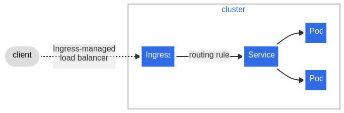

# Ingress

Make your HTTP (or HTTPS) network service available using a protocol-aware configuration mechanism, that understands web concepts like URIs, hostnames, paths, and more. The Ingress concept lets you map traffic to different backends based on rules you define via the Kubernetes API.

> [!NOTE]
> FEATURE STATE: Kubernetes v1.19 [stable]

An API object that manages external access to the services in a cluster, typically HTTP.

Ingress may provide load balancing, SSL termination and name-based virtual hosting.

> [!NOTE]
> Ingress is frozen. New features are being added to the [Gateway API](../Gateway/README.md).

## What is Ingress?

Ingress exposes HTTP and HTTPS routes from outside the cluster to services within the cluster. Traffic routing is controlled by rules defined on the Ingress resource.

Here is a simple example where an Ingress sends all its traffic to one Service:



## Install Ingress With [Helm]()

### 1. Install Helm

```bash
curl https://raw.githubusercontent.com/helm/helm/main/scripts/get-helm-3 | bash
```

### 2. Add Nginx Repository

```bash
helm repo add ingress-nginx https://kubernetes.github.io/ingress-nginx

helm repo update
```

> There are 2 ways for bringing ingress controller up:

### 3. Install Nginx Deployment With Replica (method 1)

```bash
helm install nginx-ingress ingress-nginx/ingress-nginx \
  --namespace ingress-nginx \
  --set controller.replicaCount=2 \
  --set controller.nodeSelector."kubernetes\.io/os"=linux \
  --set controller.hostNetwork=true \
  --set controller.service.type=ClusterIP \
  --set controller.admissionWebhooks.patch.nodeSelector."kubernetes\.io/os"=linux \
  --set defaultBackend.nodeSelector."kubernetes\.io/os"=linux \
  --set controller.service.enableHttp=false \
  --set controller.hostPort.enabled=true \
  --set controller.hostPort.ports.http=80 \
  --set controller.hostPort.ports.https=443 \
  --set controller.ingressClassResource.name=nginx \
  --set controller.ingressClassResource.enabled=true \
  --set controller.ingressClass=nginx \
  --create-namespace
```

### 3. Install Nginx DaemonSet With Replica (method 2)

```bash
helm install nginx-ingress ingress-nginx/ingress-nginx \
  --namespace ingress-nginx \
  --set controller.kind=DaemonSet \
  --set controller.daemonset.useHostPort=true \
  --set controller.hostNetwork=true \
  --set controller.nodeSelector."kubernetes\.io/os"=linux \
  --set controller.service.type=ClusterIP \
  --set controller.ingressClassResource.enabled=true \
  --set controller.ingressClassResource.name=nginx \
  --set controller.ingressClass=nginx \
  --set controller.hostPort.enabled=true \
  --set controller.hostPort.ports.http=80 \
  --set controller.hostPort.ports.https=443 \
  --create-namespace
```

### Apply Sample Deployment With Service

**`nginx.yml`**

```yml
# nginx deployment
apiVersion: apps/v1
kind: Deployment
metadata:
  name: nginx-deployment
  labels:
    app: nginx
spec:
  replicas: 2
  selector:
    matchLabels:
      app: nginx
  template:
    metadata:
      labels:
        app: nginx
    spec:
      containers:
      - name: nginx
        image: nginx
        ports:
        - containerPort: 80
---
# nginx svc
apiVersion: v1
kind: Service
metadata:
  name: nginx-service
  labels:
    app: nginx
spec:
  selector:
    app: nginx
  ports:
  - protocol: TCP
    port: 80
    targetPort: 80
---
# ingress
apiVersion: networking.k8s.io/v1
kind: Ingress
metadata:
  name: nginx-ingress
  namespace: default
  annotations:
spec:
  ingressClassName: nginx
  rules:
  - host: packops.local
    http:
      paths:
      - path: /
        pathType: Prefix
        backend:
          service:
            name: nginx-service
            port:
              number: 80
```

### Verify Ingress

```bash
kubectl get ingress
kubectl get pods -n ingress-nginx -o wide
```

### Set Custom Header For Check Ingress

```bash
curl -H 'Host:packops.local' http://192.168.10.25
```

## Install Ingress With Manifest(listen on port 80)

**[ingress-host-mode.yml](/configs/extra/ingress-host-mode.yml)**

```bash
kubectl apply -f ingress-host-mode.yml

kubectl delete -A ValidatingWebhookConfiguration ingress-nginx-admission
```

### Scale up ingress controler to 3 (in our scenario we have 3 node)

```bash
kubectl scale  deployments ingress-nginx-controller -n ingress-nginx --replicas 3
```

### apply simple app that listen on 5678  (apple.packops.local)

**[nginx-ingress.yml](/configs/extra/nginx-ingress.yml)**

```bash
kubectl -f nginx-ingress.yml
```

### Set host apple.packops.local tp kubernetes ip

#### Example

**[nginx-ingress.yml](/configs/extra/nginx-ingress.yml)**

```bash
kubectl apply -f nginx-ingress.yml
```

```bash
curl -H 'Host:packops.local' http://192.168.10.25/apple
```