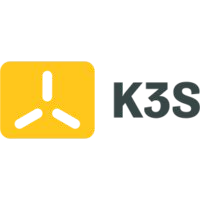

# K3s Installation



Lightweight Kubernetes. Easy to install, half the memory, all in a binary of less than 100 MB.

## Installation

```bash
curl -sfL https://get.k3s.io | sh -
```

### Install kubectl

```bash
curl -LO "https://dl.k8s.io/release/$(curl -L -s https://dl.k8s.io/release/stable.txt)/bin/linux/amd64/kubectl"
```

```bash
sudo install -o root -g root -m 0755 kubectl /usr/local/bin/kubectl
```