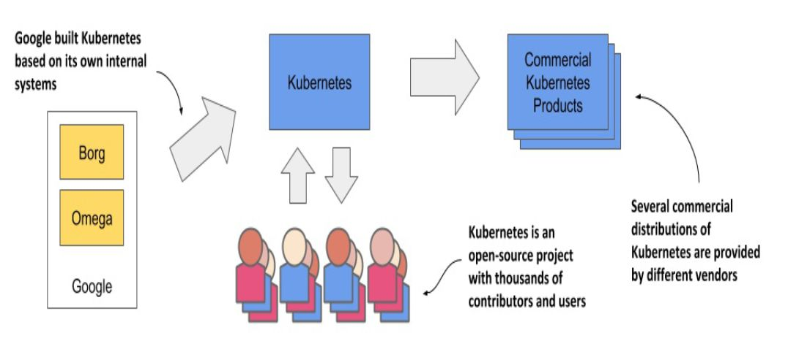
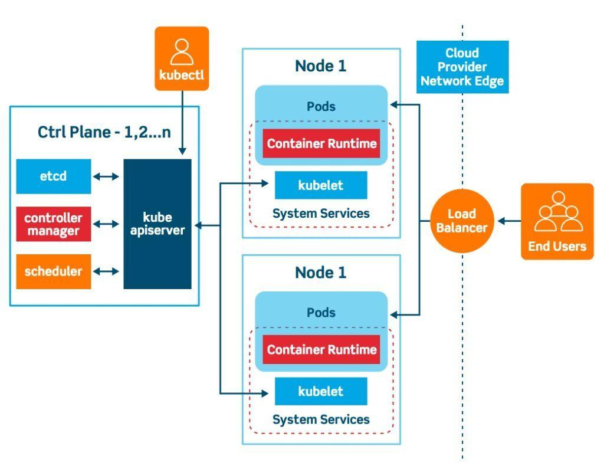

# Kubernetes

Kubernetes was originally developed by Google. Google has practically always run applications in containers.
As early as 2014, it was reported that they start two billion containers every week .
Google developed an internal system called **Borg** (and later a new system called **Omega**)

Kubernetes (K8s) is an **open-source container orchestration** platform that automates the deployment, scaling, and management of containerized applications. It was originally developed by Google and is now maintained by the **Cloud Native Computing Foundation (CNCF)**.

**Kubernetes helps developers by:**

- ✅ Automating deployments and updates
- ✅ Scaling applications up and down based on demand
- ✅ Self-healing (restarts failed containers)
- ✅ Load balancing traffic across instances
- ✅ Managing networking, storage, and security

## Kubernetes Architecture

A Kubernetes cluster consists of a control plane plus a set of worker machines, called nodes, that run containerized applications. Every cluster needs at least one worker node in order to run Pods.

The worker node(s) host the Pods that are the components of the application workload. The control plane manages the worker nodes and the Pods in the cluster. In production environments, the control plane usually runs across multiple computers and a cluster usually runs multiple nodes, providing fault-tolerance and high availability.

Kubernetes follows a **master-worker** architecture, consisting of multiple components that work together.

### 1️⃣ Control Plane (Master Node)

The **Control Plane** is responsible for managing the cluster and making global decisions. It consists of:

#### 🔹 API Server (**`kube-apiserver`**)

- The main entry point for communication with the cluster
- Exposes the Kubernetes API for users and services
- Handles requests from **`kubectl`**, controllers, and other components

#### 🔹 Controller Manager (**`kube-controller-manager`**)

- Manages controllers that handle tasks like node monitoring, scaling, and ensuring desired state
- Examples: ReplicaSet controller, Node controller, and Job controller

#### 🔹 Scheduler (**`kube-scheduler`**)

- Assigns new Pods to worker nodes based on resource availability and constraints

#### 🔹 etcd (**Key-Value Store**)

- Stores all cluster data, including configuration, state, and metadata
- Highly available and distributed

#### 🔹 Cloud Controller Manager (optional)

- Integrates with underlying cloud provider(s)

### 2️⃣ Worker Nodes

Worker nodes **run application workloads** and are managed by the control plane. Each worker node contains:

#### 🔹 Kubelet

- Runs on every node and communicates with the control plane
- Ensures that the containers are running in a Pod as defined in the desired state

#### 🔹 Container Runtime

- Software that runs containers (e.g., Docker, containerd, CRI-O)

#### 🔹 Kube-Proxy (optional)

- Manages networking and load balancing between Pods

## Kubernetes Workflow 🚀

- 1️⃣ You define the desired state using YAML manifests (e.g., **`Deployment`**, **`Service`**)
- 2️⃣ You apply them using **`kubectl apply -f deployment.yml`**
- 3️⃣ The API Server stores the configuration in etcd
- 4️⃣ The Scheduler assigns Pods to available nodes
- 5️⃣ The Kubelet on each node pulls the container image and runs the Pod
- 6️⃣ Kube-Proxy sets up networking to allow communication between Pods
- 7️⃣ Kubernetes continuously monitors and ensures the desired state is maintained

## Kubernetes Core Objects

- **Pod 🟢** → Smallest unit, holds one or more containers
- **Deployment 🚀** → Manages replica Pods for rolling updates
- **Service 🔗** → Exposes Pods internally or externally
- **ConfigMap/Secret 🔑** → Stores environment variables and credentials
- **PersistentVolume (PV)/PersistentVolumeClaim (PVC) 🗄️** → Manages storage
